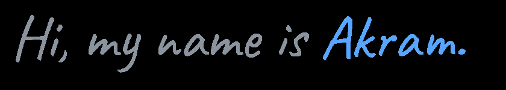

  

Currently, I’m an **Informatics Engineering student at Institut Teknologi Bandung**, exploring applied AI, backend development, and competitive programming. Previously, I worked as an **AI Engineer Intern at ICS Compute**, where I built an end-to-end HR Assistant chatbot for HR policies and SOPs. I enjoy turning ideas into useful applications and sharpening my problem-solving skills along the way.

  
  &nbsp;
  

## Tech stack

**Languages**

           

**Web & Backend**

       

**Tools & Cloud**

     

**Data & ML**

   

### Achievements

- Finalist, ICPC Asia Jakarta Regional Contest — 2025.
- 2× National Finalist, Indonesian Olympiad in Informatics (OSN) — 2022 & 2023.

## Selected projects

| Project | What I built |
| :--- | :--- |
| **[HR Assistant](https://github.com/Akram17t/Internship)** | AI-powered Q&A for HR policies and SOPs, with an end-to-end RAG pipeline. |
| **[DOMichelis](https://github.com/Akram17t/Tubes2_Manchester-City)** | DOM traversal and CSS selector matching with BFS and DFS. |
| **[Eigenfaces](https://github.com/Akram17t/FaceRecognition-IRK)** | A face recognition web app with a Python backend. |
| **[N-Queens Solver](https://github.com/Akram17t/Tucil1_13524090)** | C++ backtracking with coloring constraints and a live web visualization. |

More projects

- **[CommunityMap](https://github.com/Akram17t/CommunityMap)** — Crowdsourced reports of public infrastructure and road conditions.
- **[AutoKey](https://github.com/Akram17t/Autokey-IRK)** — Indonesian autocomplete and spell-checking with FastAPI and Next.js.
- **[The Great Wrap](https://github.com/Akram17t/ConvexHull-IRK)** — Interactive convex hull visualization with React and TypeScript.
- **[Wayfinder3D](https://github.com/Akram17t/PathFinding3D-IRK)** — 3D pathfinding visualization with Rust, WebAssembly, and Svelte.
- **[Judol Detector](https://github.com/Akram17t/Tubes3_Komisi-Pemberantas-Judol)** — Browser extension with text matching and image OCR.

## Certifications

- AWS Certified Solutions Architect – Associate
- AWS Certified AI Practitioner
- [AWS Academy Graduate – Cloud Foundations](https://www.credly.com/badges/cc31ae86-9e40-434c-9374-daa00c6881d4) — [Verify credential](https://www.credly.com/badges/cc31ae86-9e40-434c-9374-daa00c6881d4)

## GitHub stats

  

  

